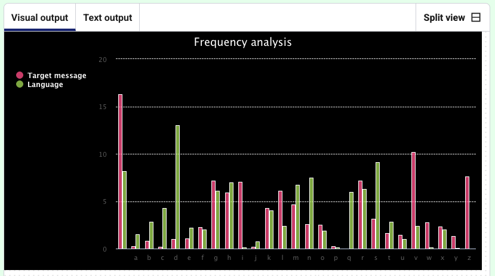

<h2 class="c-project-heading--task">Analyse more text</h2>
--- task ---
Change your code so that it analyses the message in `longer.txt`. 
--- /task ---

Codebreakers can use the frequency of letters to work out the type of encoding that has been used on the message. They can use trial and error to **predict** what a letter might represent using the chart as a guide. 

Your secret message is quite small, which makes it tricky to analyse using a frequency chart. 

Change `input.txt` to `longer.txt`.

--- code ---
---
language: python
filename: main.py
line_numbers: true
line_number_start: 75
line_highlights: 77
---
    elif choice == 'f':
        print('Analysing message…')
        message = get_text('longer.txt') 
        message_freq = frequency(message)  # Get the frequency of the letters in the message, as %
--- /code ---

**Test:** Run the code and notice how the highest bar for **Language** is **e** and the highest bar for **Target message** is **v**. This is because with the **Atbash** cypher, the letter **e** is encoded with the letter **v**. 

<h2 class="c-project-heading--task">Visualise the frequency</h2>
--- task ---
Make a bar chart to visualise the letter frequency
--- /task --- 

First add a `#` to the beginning of the `print(message_freq)` line so that Python ignores it. 

--- code ---
---
language: python
filename: main.py
line_numbers: true
line_number_start: 72
line_highlights: 76
---
    elif choice == 'f':
        print('Analysing message…')
        message = get_text('input.txt')  # Take input from the same file
        message_freq = frequency(message)  # Get the frequency as %
        # print(message_freq)
--- /code ---

<h2 class="c-project-heading--explainer">Make the bar chart function</h2>

Find the `# Make frequency chart` comment and create a new function called `make_chart()`. 

--- code ---
---
language: python
filename: main.py
line_numbers: true
line_number_start: 36
line_highlights: 37-38
---
# Make frequency chart
def make_chart(text, language): 
    chart = Bar(width=800, height=400, title='Frequency analysis', x_labels = list(text.keys())) # Make a bar chart
    chart.add('Target message', list(text.values()))  # Label the frequency data for the encoded message
    chart.add('Language', list(language.values()))  # Label the frequency data for the language

    chart.render() #Render the chart 
--- /code ---

<h2 class="c-project-heading--explainer">Call the frequency chart function<h2>

In the `menu()` function add the two lines of code below.

--- code ---
---
language: python
filename: main.py
line_numbers: true
line_number_start: 75
line_highlights: 80-81
---
def menu():
    choice = ''  # Start with a wrong answer for choice.

    while choice != 'c' and choice != 'f':  # Asking for the right answer
        choice = input('Enter c to encode/decode text, or f for frequency analysis: ')

    if choice == 'c':
        print('Running your message through the cypher…')
        message = get_text('input.txt')  # Take input from a file
        code = atbash(message)
        print(code)

    elif choice == 'f':
        print('Analysing message…')
        message = get_text('input.txt')
        message_freq = frequency(message)
        #print(message_freq)
        lang_freq = english  # Import the English frequency dictionary
        make_chart(message_freq, lang_freq)  # Call the function to make a chart
--- /code ---

**Test:** Run your code to display the frequency analysis bar chart. 

Your chart doesn't look exactly the same as the one displayed in the image above:
- This is normal. Your chart will display the frequency data for the secret message that you have entered in `input.txt`.

You see the following error message `NameError: name 'lang_freq' is not defined`:
- Check that you added the line of code `lang_freq = english` **before** the `make_chart()` function call.

You see an `Indentation error` message:
- Check that you have correctly indented all of your new code. Revisit the tasks above to check.

