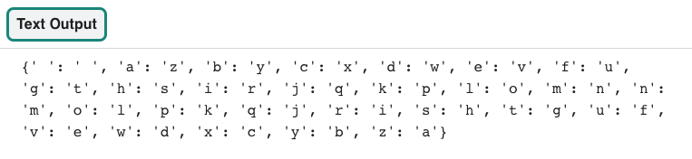

## Encode the alphabet

<div style="display: flex; flex-wrap: wrap">
<div style="flex-basis: 200px; flex-grow: 1; margin-right: 15px;">
To start, you will create a dictionary for your encoded letters. 
</div>
<div>
{:width="600px"}
</div>
</div>

--- task ---

Open the [Codebreaker starter project](https://editor.raspberrypi.org/en/projects/codebreaker-project-starter){:target="_blank"}. The Raspberry Pi code editor will open in another browser tab.

If you have a Raspberry Pi account, you can click **Save** to save a copy of the starter code to your library.

If you are not using the code editor in your browser, you will need to download the project files and you may need to install `pygal` before you can import it.

--- collapse ---
---
title: Installing pygal
---

### On Windows
In the **Command Prompt** type the following and press the <kbd>Enter</kbd> key:

```
pip install pygal
```

Wait for the installation to complete and then continue with the project.

### On a Mac
In the **Terminal** type the following and press the <kbd>Enter</kbd> key:

```
pip3 install pygal
```

Wait for the installation to complete and then continue with the project.

### On Linux, including Raspberry Pi OS
In the **Terminal** type the following and press the <kbd>Enter</kbd> key:

```
pip install pygal
```

Wait for the installation to complete and then continue with the project.

--- /collapse ---

--- /task ---

### Set up the alphabet list and the code dictionary

The codebreaker program starts with two data structures. The first data structure is a **list** of all the letters in the alphabet and the second is a `code` **dictionary**. To save typing time, you can create a list from a string by using the `list()` function.  

[[[list-function]]]

--- task ---

Find the `# Set up data structures` comment in the program, then use the `list()` function to create a **list** of letters from the `alphabet`. Next, **initialise** the `code` **dictionary** so that you can populate it in a later step.  

The `alphabet` list contains spaces at the beginning and end to preserve the spaces in the message. Strong encryption would not do this, as it makes the message easier to decode. The spaces have been kept in for this project to make the messages easier to read. 

--- code ---
---
language: python
filename: main.py
line_numbers: true
line_number_start: 5 
line_highlights: 6-7
---
# Set up data structures
alphabet = list(' abcdefghijklmnopqrstuvwxyz ')  # List from a string
code = {}

--- /code ---

--- /task ---

### Create a new list that reverses the alphabet

You need to create a new list that holds the alphabet, but backwards. You can use the `list()` function again to help with this. You can also use the `reversed()` function to reverse an existing list. 

--- task ---

Find the `# Create the atbash code by reversing the alphabet` comment then **define** a new function called `create_code`. Next, create a **list** that holds the **reverse** of the `alphabet` list. 

--- code ---
---
language: python
filename: main.py - create_code()
line_numbers: true
line_number_start: 10 
line_highlights: 11-12
---
# Create the atbash code by reversing the alphabet
def create_code():
    backwards = list(reversed(alphabet))  # Reverses a list

--- /code ---

--- /task ---

### Encode the alphabet

<p style='border-left: solid; border-width:10px; border-color: #0faeb0; background-color: aliceblue; padding: 10px;'>
Encoding is when you convert data from one form to another. In an atbash cypher for example, the letter 'e' would be **encoded** as a 'v'. 
</p>

You now have two lists. One contains the alphabet written forwards, the other with the alphabet backwards. You are now going to use these two lists to populate a dictionary. The **key** will store the alphabet written forwards and the **paired value** will store the alphabet backwards. 

The code dictionary is really important because you can use it to match each letter from your message using the **key**, with its encoded **paired value**. 

--- task ---

Within your `create_code` function, **populate** the `code` dictionary with data from the two **lists**. Use a `for` loop to get the length of the `alphabet` list and populate the **dictionary** with the data. 

`len()` is a function that you can use to find out the length of an **object**, such as a list. It is used here to iterate a `for` loop, as many times as there are characters in the `alphabet` list — its length. 

--- code ---
---
language: python
filename: main.py - create_code()
line_numbers: true
line_number_start: 11
line_highlights: 14-15
---
def create_code():
    backwards = list(reversed(alphabet))  # Reverses a list

    for i in range(len(alphabet)):  # Gets the length of a list
        code[alphabet[i]] = backwards[i]  # Populate the code dictionary with a letter of the alphabet and its encoded letter
--- /code ---

--- /task ---

Creating a `main()` function is useful to **call** all of the required functions when your program first starts. 

--- task ---

Find the `# Start up` comment and **define** a `main()` function to call your `code()` function. Next, call the `main()` function in the main body of your code. 

--- code ---
---
language: python
filename: main.py - main()
line_numbers: true
line_number_start: 37
line_highlights: 38-41
---
# Start up
def main():
    create_code()

main()
--- /code ---

--- /task ---

### Test and debug

--- task ---

To test that your `code` dictionary has populated correctly, you can `print` the dictionary in full. Under your `for` loop in the `create_code` function, add a `print` function to display the contents. 

--- code ---
---
language: python
filename: main.py - create_code()
line_numbers: true
line_number_start: 11
line_highlights: 17
---
def create_code():
    backwards = list(reversed(alphabet))

    for i in range(len(alphabet)):  #  Gets length of a list
        code[alphabet[i]] = backwards[i]  #  Populates the code dictionary with a letter of the alphabet and its encoded letter

    print(code)
--- /code ---

--- /task ---

--- task ---

**Test:** Run your code to see if the `code` dictionary displays correctly. You should see a pattern starting with the letter `a` paired with `z` and the letter `b` being paired with `y`.


{:width="600px"}

**Debug:** There are no error messages but your code dictionary is not displaying on the screen:
- Make sure that `print(code)` is indented correctly within the `create_code` function
- Check that you have **called** the `create_code()` and the `main()` function correctly

**Debug:** If you see a message about `code` not being defined, make sure that you have initialised the `code` dictionary. 

**Debug:** If you see a message about an indentation error:
- Check that you have indented all of your code correctly
- Look back at the sample code on this page to help you check

--- /task ---

In the next step, you will **encode** a message with the help of your `code` dictionary. 

--- save ---
