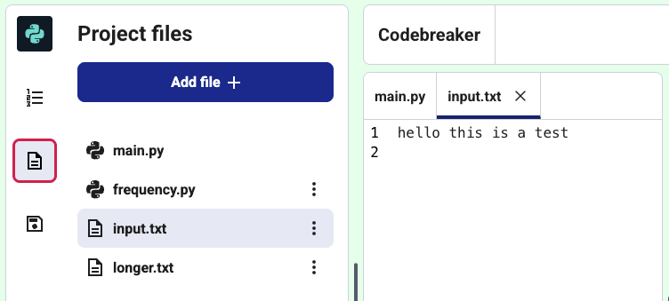

<h2 class="c-project-heading--task">Encode text from a file</h2>
--- task ---
Encode text from a file into a secret message using the **atbash** code.
--- /task ---
 
--- task ---
Click the file icon in the project files window. Select **input.txt** to open it in a new tab.
You can edit the file by typing into it, or you can leave it as it is.
--- /task ---

The code below reads the text from the file. Paste it into your project, then print the text to check it works.

--- code ---
---
language: python
filename: main.py
line_numbers: true
line_number_start: 22
line_highlights: 24-32
---
print(atbash('hello world')) # print to check that it works

# Create the get_text function
def get_text(filename):
    with open(filename) as f: # open the file
        text = f.read().replace('\n','')  # read file and replace newline

    return text # Return the text

print(get_text('input.txt')) # print to check that it works
print(atbash(get_text('input.txt'))) # print to check that it works

--- /code ---
--- task ---
**Test:** Run your code. You should see two lines of output.
The first line is the text from the file.
The second line is the encoded message.
--- /task---

<pre>hello this is a test</pre>
<pre>svool gsrh rh z gvhg</pre>

