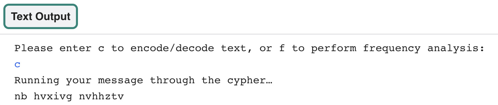

<h2 class="c-project-heading--task">Create a menu</h2>
--- task ---
Create a menu system for your user to make choices about what they would like to do
--- /task ---

**Find** the comment in your code that says `# Create a text-based menu system` and begin by defining a function called `menu()`:

Create a new variable called `choice` and set the value to `''`:

--- code ---
---
language: python
filename: main.py 
line_numbers: true
line_number_start: 41
line_highlights: 43-44
---
# Create a text-based menu system  
def menu():
    choice = ''  # Start with a wrong answer for choice.

--- /code ---

Create a **while loop** that runs as long as your answer **DOES NOT** match one you have defined. 

As long as the user **does not** choose `c` or `f`, the loop will continue to run. Enter the code that will set the **conditions** for a **while loop** and prompt the user for input:

--- code ---
---
language: python
filename: main.py 
line_numbers: true
line_number_start: 42
line_highlights: 45-46
---
def menu():
    choice = ''  # Start with a wrong answer for choice

    while choice != 'c' and choice != 'f':  # Keep asking the user for the right answer
        choice = input('Enter c to encode/decode text, or f for frequency analysis: ')
--- /code ---

Next create an `if` statement that will run your `atbash` function if the user enters `c`.

You can change the string that says `'my secret message'` to anything you like. This string is the message that will be encoded and decoded.

--- code ---
---
language: python
filename: main.py
line_numbers: true
line_number_start: 42
line_highlights: 48-52
---
def menu():
    choice = ''  # Start with a wrong answer for choice

    while choice != 'c' and choice != 'f':  # Keep asking the user for the right answer
        choice = input('Please enter c to encode/decode text, or f to perform frequency analysis: ')

    if choice == 'c':
        print('Running your message through the cypher…')
        message = 'my secret message' 
        code = atbash(message)
        print(code)

--- /code ---

At the end of your `main()` function, type `menu()` to call the `menu` function when the program runs:

--- code ---
---
language: python
filename: main.py 
line_numbers: true
line_number_start: 54
line_highlights: 58
---
# Start up
def main():
    create_code()
    # print(atbash('Test'))
    menu()

--- /code ---

**Test:** Run your code. Type `c` and press **Enter** to encode your message!

{:width="400px"}

### Debugging
If you see a message about an indentation error:
- Check that you have indented all of your code correctly
- Look back at the sample code on this page to help you check

If you see the error message `c is not defined` when you run your code, check that you have used apostrophes ('') around your c in the condition `choice != 'c'`.

If nothing happens when you press `c`, check that you have correctly spelled `message`.

