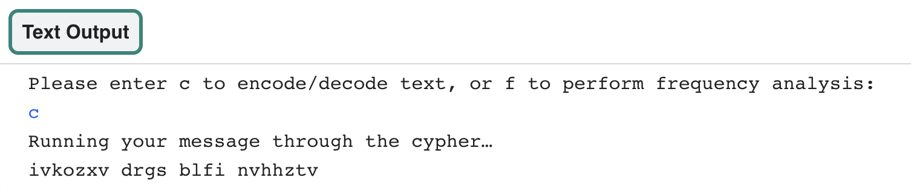

<h2 class="c-project-heading--task">Encode text from a file</h2>

Find the `# Fetch and return text from a file` comment and add the code below. 

then define a `get_text()` function. This function has one parameter called `filename`. Use the `filename` to open the file and read it into the `text` variable, then **return** the `text` variable.

--- code ---
---
language: python
filename: main.py 
line_numbers: true
line_number_start: 37
line_highlights: 38-42
---
# Fetch and return text from a file
def get_text(filename): 
    with open(filename) as f: # open the file
        text = f.read().replace('\n','')  # read file and replace newline

    return text # Return the text
--- /code ---

The `menu()` function needs to encode a secret message from a text file. **Replace** your secret message with the `get_text()` function call. Enter the name of the file `input.txt`.

--- code ---
---
language: python
filename: main.py 
line_numbers: true
line_number_start: 52
line_highlights: 54
---
    if choice == 'c':
        print('Running your message through the cypher…')
        message = get_text('input.txt')  # Take input from a file
        code = atbash(message)
        print(code)
--- /code ---

You can now **add** your own secret message to the `input.txt` file. 

Find `input.txt` in the file tab. Delete the `replace with your message` text and enter your own secret message. 

**Test:** Run your code to see if it displays your encoded message after entering the letter 'c' when prompted. 

### Debugging
**Debug:** Your encoded message doesn't look exactly like the message in the screenshot:
- This is normal. This is the encoded message for the text `replace with your message`. Your message will be different.

**Debug:** You see an error message that says `TypeError: get_text() takes exactly 1 arguments`:
- Check that you have entered `input.txt` inside the round brackets on line 57

**Debug:** You see an `Indentation error` message:
- Check that you have correctly indented all of your new code. Revisit the tasks above to check. 

