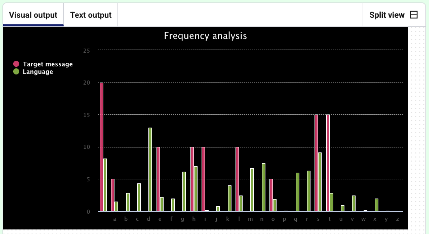

<h2 class="c-project-heading--task">Create a chart</h2>
--- task ---
Make a bar chart to show the letter frequency
--- /task ---

--- task ---
Add the code under the `frequency` function. 

You also need to add `make chart` at the end so the chart is created.
--- /task ---

--- code ---
---
language: python
filename: main.py
line_numbers: true
line_number_start: 44
line_highlights: 46-51, 71
---
print(frequency(get_text('input.txt'))) # print to check that it works

# Create the chart 
def make_chart(text, language):
    chart = Bar(width=800, height=400, title='Frequency analysis', x_labels = list(text.keys())) # Make a bar chart
    chart.add('Target message', list(text.values()))  # Label the frequency data for the encoded message
    chart.add('Language', list(language.values()))  # Label the frequency data for the language
    chart.render() #Render the chart

# User input
choice = ''  # Start with a wrong answer for choice.

while choice != 'e' and choice != 'f':  # Asking for the right answer
    choice = input('Enter e to encode text, or f for frequency analysis: ')

    if choice == 'e':
        print('Running your message through the cypher…')
        message = get_text('longer.txt')  # Take input from a file
        cyphertext = atbash(message)
        print(cyphertext)
    
    elif choice == 'f':
        print('Analysing message…')
        message = get_text('input.txt')
        message_freq = frequency(message)
        #print(message_freq)
        lang_freq = english  # Import the English frequency dictionary
        make_chart(message_freq, lang_freq)  # Call the function to make a chart        
--- /code ---
--- task ---
**Test:** Run your code to see the user prompt. 
--- /task ---

<pre>Enter e to encode/decode text, or f for frequency analysis: </pre>

--- task ---
Type `f` and press Enter.  
Switch to the **Visual output** tab to see the chart.
--- /task ---

### Tip

To see a different chart, edit the text in `input.txt` and run your code again.
</tip>