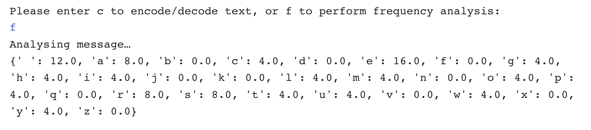

## Create a frequency analyser

In this step, you will code a frequency analyser function to work out how often each letter of the alphabet appears in your text. 

Frequency analysis measures how often something appears so you can look for patterns in that data. It is possible to decode monoalphabetic cyphers (if you know the language the message is in) by looking at how often each letter appears and matching it to the [most commonly used letters](http://letterfrequency.org/letter-frequency-by-language/) in that language. This will be explained in further detail later.

You now need to create a function that will take your text and convert it all to one case (to avoid confusion), count the number of times each letter in the message appears, then convert that number into a percentage of the whole so you can compare it to the frequency of letters in English.

--- task ---

Beneath the comment that reads `# Calculate the frequency of all letters in a piece of text`, define a function called `frequency`, and have the first thing it does be to convert your message to lower case and make it a list:

--- code ---
---
language: python
filename: main.py
line_numbers: true
line_number_start: 18
line_highlights: 19-20
---
# Calculate the frequency of all letters in a piece of text
def frequency(text):
    text = list(text.lower())  # Convert the message to lower case and make it a list
--- /code ---

--- /task ---

--- task ---

Create a dictionary called `freq` and for every `letter` in the list `alphabet` assign a value of `0`. Make sure you **keep the indentation** and type:

--- code ---
---
language: python
filename: main.py - frequency()
line_numbers: true
line_number_start: 18
line_highlights: 22-24
---
# Calculate the frequency of all letters in a piece of text
def frequency(text):
    text = list(text.lower())  # Convert the message to lower case and make it a list

    freq = {}  # Create a dictionary of every letter, with a count of 0
    for letter in alphabet:
        freq[letter] = 0
--- /code ---

--- /task ---

--- task ---

The next thing you need your function to do is to count the all letters in the message. Create a variable called `total_letters` and assign the length of the text to that variable. 

Make sure you **keep the indentation** as shown in this code.

--- code ---
---
language: python
filename: main.py
line_numbers: true
line_number_start: 18
line_highlights: 26
---
# Calculate the frequency of all letters in a piece of text
def frequency(text):
    text = list(text.lower())  # Convert the message to lower case and make it a list

    freq = {}  # Create a dictionary of every letter, with a count of 0
    for letter in alphabet:
        freq[letter] = 0

    total_letters = len(text)  # Count the letters in the message
--- /code ---

--- /task ---

Once you know how long the message is, you can begin counting the letters in it to determine how often they appear.

--- task ---

Create a `for` loop to count every time each letter appears in the text. Leave a blank line at the end of your script, make sure you keep the indentation, and add:

--- code ---
---
language: python
filename: main.py
line_numbers: true
line_number_start: 18
line_highlights: 28-30
---
# Calculate the frequency of all letters in a piece of text
def frequency(text):
    text = list(text.lower())  # Convert the message to lower case and make it a list

    freq = {}  # Create a dictionary of every letter, with a count of 0
    for letter in alphabet:
        freq[letter] = 0

    total_letters = len(text)  # Count the letters in the message

    for letter in text:
        if letter in freq:
            freq[letter] += 1
--- /code ---

--- /task ---

--- collapse ---
---
title: Count the letters 
---

--- code ---
---
language: python
filename: main.py
line_numbers: false
line_number_start:
line_highlights:
---
    for letter in text:
        if letter in freq:
            freq[letter] += 1
--- /code ---

This section of code looks at each of the letters in your message `text`, and if the letter appears in your frequency list, it adds `1` to that letter's value. The more times a letter appears, the higher that value will be. Once you know how often each letter appears, you can then convert from this count to a percentage of the whole message (since you know its length). Any characters that are not in the dictionary — such as punctuation — will be ignored, and won't appear in the message.

--- /collapse ---

--- task ---

Create a `loop` that converts the number of times the letters appear into a percentage of the whole message.
 
--- code ---
---
language: python
filename: main.py
line_numbers: true
line_number_start: 18
line_highlights: 32-33
---
# Calculate the frequency of all letters in a piece of text
def frequency(text):
    text = list(text.lower())  # Convert the message to lower case and make it a list

    freq = {}  # Create a dictionary of every letter, with a count of 0
    for letter in alphabet:
        freq[letter] = 0

    total_letters = len(text)  # Count the letters in the message

    for letter in text:
        if letter in freq: 
            freq[letter] += 1

    for letter in freq:
        freq[letter] = freq[letter] / total_letters * 100  # Convert from counts to percentages
--- /code ---

--- /task ---

--- task ---

**Return** the frequency dictionary so it can be used elsewhere in your code. Leave a blank line and type:

--- code ---
---
language: python
filename: main.py
line_numbers: true
line_number_start: 18
line_highlights: 35
---
# Calculate the frequency of all letters in a piece of text
def frequency(text):
    text = list(text.lower())  # Convert the message to lower case and make it a list

    freq = {}  # Create a dictionary of every letter, with a count of 0
    for letter in alphabet:
        freq[letter] = 0

    total_letters = len(text)  # Count the letters in the message

    for letter in text:
        if letter in freq: 
            freq[letter] += 1

    for letter in freq:
        freq[letter] = freq[letter] / total_letters * 100  # Convert from counts to percentages

    return freq
--- /code ---

--- /task ---

### Extend the menu to include 'f'

Now that you have a function that can calculate the frequency of letters in your message, you need to link it to your user menu. Right now, the user can only choose the letter 'c' to encode or decode a message. If they type the letter 'f', nothing happens. You are now going to add the option 'f' to analyse the letter frequency of your message by calling your new function. 

Underneath your first `if` statement asking the user to select 'c', you need to add an `elif` statement so the user can choose the option to analyse and print the letter frequency by pressing 'f'.

--- task ---

Leave a blank line after the `if` statement and, on line 72, type:

--- code ---
---
language: python
filename: main.py
line_numbers: true
line_number_start: 63
line_highlights: 72-76
---
    while choice != 'c' and choice != 'f':  # Keep asking the user for the right answer
        choice = input('Please enter c to encode/decode text, or f to perform frequency analysis: ')

    if choice == 'c':
        print('Running your message through the cypher…')
        message = get_text('input.txt')  # Take input from a file 
        code = atbash(message)
        print(code)

    elif choice == 'f':
        print('Analysing message…')
        message = get_text('input.txt')
        message_freq = frequency(message)
        print(message_freq)
--- /code ---

--- /task ---

--- task ---

Save and run your code. Choose 'f' at the prompt and you should see a readout of the letter frequency of your message in the console. The values you see from your message will be different from the values shown here:

--- /task ---

In the next step, you will display the frequency analysis data in a cool looking chart!

--- save ---
